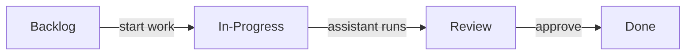
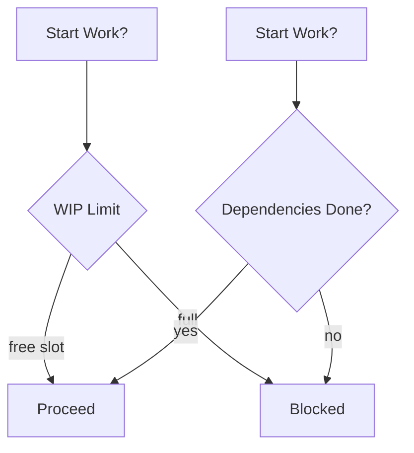
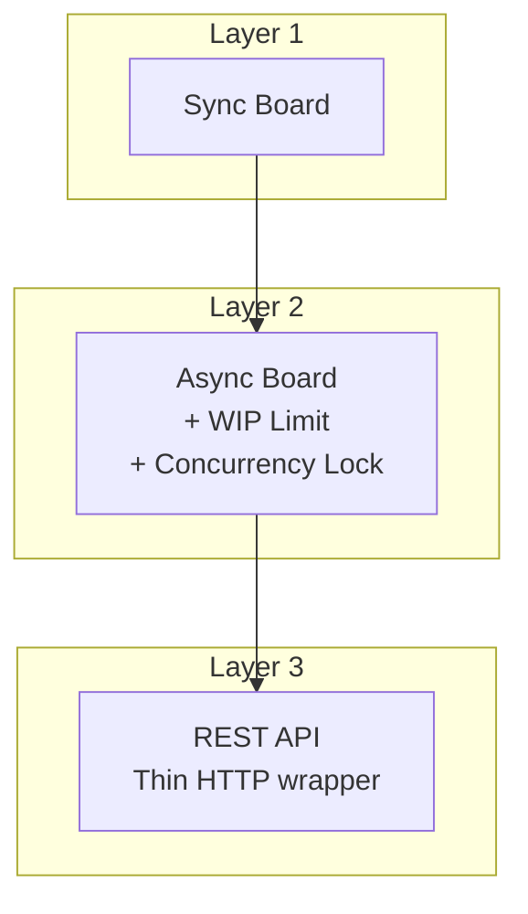
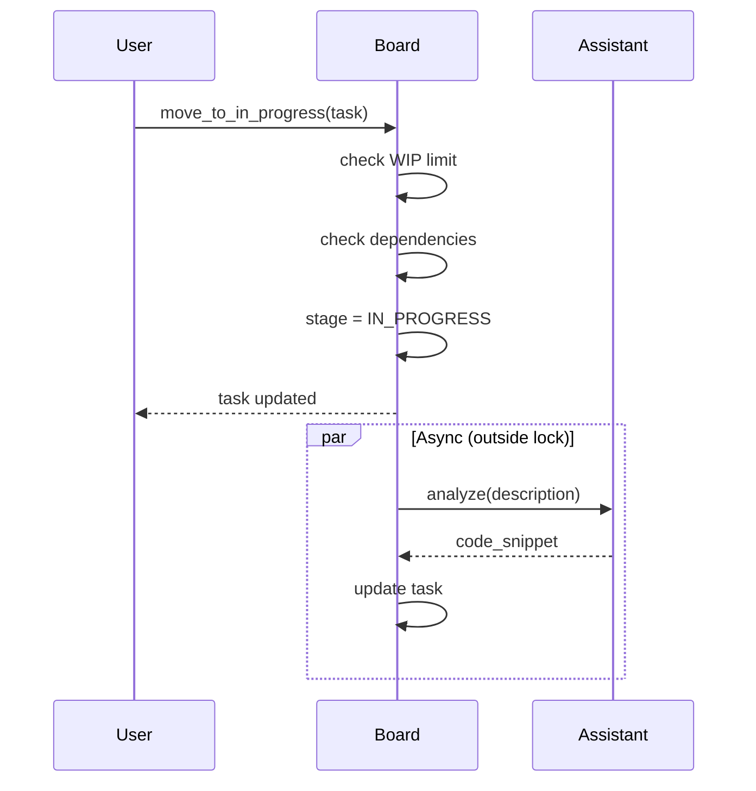

# Kanban Board

A Python Kanban board focused on logic, not UI.

---

## Core Flow



Tasks move through four stages. When a task enters In-Progress, a coding assistant analyzes its description and generates a code snippet automatically.

The assistant is injectable — swap the mock for a real Claude API call with one argument.

---

## Two Hard Rules



**WIP Limit**: Caps how many tasks can be in-progress simultaneously. Prevents context-switching overload.

**Dependency Tracking**: A task can't start until every task it depends on reaches Done.

---

## Architecture



Three complementary implementations, each building on the previous:

### Sync Board — Foundation
- Simple task entity with stage
- Linear flow enforcement
- JSON persistence
- Plain callable assistant (swap in one line)

### Async Board — Discipline
- **WIP limit**: natural pull system, capacity dictates flow
- **Asyncio.Lock**: protects shared state under concurrent load
- **Optimization**: assistant runs outside lock (pure I/O, no mutation)

### REST API — Separation
- Translates HTTP ↔ domain
- Validates input (Pydantic)
- Maps exceptions to HTTP codes
- **No business logic** — all lives in board

---

## The Assistant Contract

```python
async def assistant(description: str) -> str:
    return code_snippet
```

That's it. The board doesn't care how you generate code — Claude, GPT, local model, or template. Swap without touching board logic.

---

## Flow in Practice



**Key**: The assistant runs concurrently and outside the lock. Multiple tasks can be analyzed in parallel while state mutations stay thread-safe.

---

## Error as Policy

| Error | Meaning | HTTP Code |
|-------|---------|-----------|
| `WIPLimitError` | Overloaded. Finish something first. | 429 |
| `UnresolvedDependencyError` | Foundation incomplete. | 409 |
| `InvalidTransitionError` | Skipping steps. | 422 |
| `TaskNotFoundError` | Doesn't exist yet. | 404 |

---

## The Bigger Idea

This isn't a task tracker. It's a laboratory for flow, discipline, and separation.

**Start simple → add discipline → expose through thin interfaces**

This is how robust systems grow.
