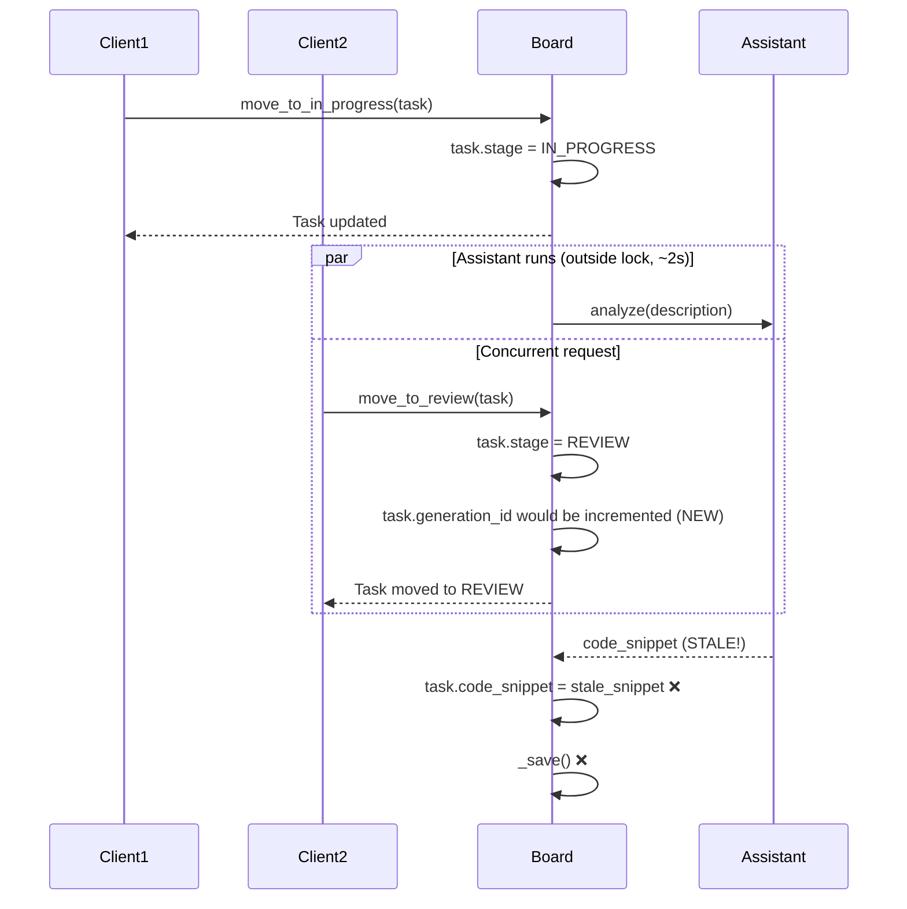

# Sprint 4.5 — Generation Counter Pattern

**Concept: Stale Response Handling in Async Workflows**
**Analogue: Craft Agents `processingGeneration` counter**

---

## Goal

Fix the race condition between `move_to_in_progress()` (assistant running) and `move_to_review()` (reviewer needs `code_snippet`). When a task moves to REVIEW while the assistant is still generating, the stale code snippet should be discarded gracefully instead of overwriting the correct state.

---

## Problem Statement

### Current Bug

When a task moves to IN_PROGRESS, the assistant runs **outside the lock** for performance. During this time, if a concurrent request moves the task to REVIEW, two issues occur:

1. **Race Condition**: Assistant's stale response may arrive AFTER `move_to_review()` completes
2. **Incorrect State**: `code_snippet` gets overwritten with stale data
3. **Reviewer Confusion**: Reviewer may analyze incomplete or incorrect code

### Sequence Diagram of Bug



### Why This Matters

- **Data Integrity**: Stale code snippets corrupt the audit trail
- **Observer/Reporter Accuracy**: Reviewer analyzes wrong code
- **System Correctness**: State machine breaks - REVIEW should have final code, not stale intermediate state

---

## Solution: Generation Counter Pattern

### Core Concept

Add a `generation_id` counter to each task. Every state transition that makes previous responses stale increments this counter. When an async operation completes, it validates its response against the current `generation_id`.

### How It Works

1. **Task Creation**: `generation_id = 0`
2. **move_to_in_progress**: Increments to 1, stores `current_generation_id = 1`
3. **Assistant runs**: Takes ~2 seconds
4. **move_to_review**: Increments to 2 (marks assistant's response as stale)
5. **Assistant finishes**: Checks if `task.generation_id (2) == current_generation_id (1)` → No, discards stale response
6. **Reviewer runs**: Sees `code_snippet = None` (correct behavior)

---

## Deliverables

### Domain Changes

- [ ] Add `generation_id: int = 0` field to `Task` dataclass
- [ ] Add helper method `is_stale_generation(expected_id: int) -> bool` to `Task`

### Board Changes

- [ ] Update `move_to_in_progress()`:
  - Increment `generation_id` before calling assistant
  - Capture `current_generation_id` outside lock
  - Validate assistant response against current `generation_id`
  - Log warning and discard stale responses

- [ ] Update `move_to_review()`:
  - Increment `generation_id` (marks assistant response as stale)
  - Reviewer receives `task.code_snippet or ""` (handles None gracefully)

### Logging Enhancements

- [ ] Add warning log when stale response detected
- [ ] Include `generation_id` values in log for debugging
- [ ] Log hook events: `on_assistant_started`, `on_assistant_finished`, `on_stale_response`

### Tests

- [ ] Test stale response discarded correctly
- [ ] Test valid response accepted when no race
- [ ] Test reviewer receives empty string when code_snippet is None
- [ ] Test multiple concurrent transitions

---

## Implementation Details

### Domain Update

```python
# kanban/domain.py

@dataclass
class Task:
    title: str
    description: str
    id: str = field(default_factory=lambda: str(uuid.uuid4())[:8])
    stage: Stage = Stage.BACKLOG
    created_at: str = field(
        default_factory=lambda: datetime.now(timezone.utc).isoformat()
    )
    code_snippet: str | None = None
    depends_on: list[str] = field(default_factory=list)
    history: list[AuditEntry] = field(default_factory=list)
    review_notes: str | None = None
    retry_count: int = 0
    generation_id: int = 0  # NEW: Track in-flight generations

    def is_stale_generation(self, expected_id: int) -> bool:
        """Check if a generation is stale (superseded by newer request)."""
        return self.generation_id != expected_id
```

### Board: move_to_in_progress

```python
# kanban/board.py

async def move_to_in_progress(self, task_id: str) -> Task:
    async with self._lock:
        task = self._get(task_id)
        self._assert_stage(task, Stage.BACKLOG)
        self._check_dependencies(task)

        wip_count = self._count_stage(Stage.IN_PROGRESS)
        if wip_count >= self._wip_limit:
            raise WIPLimitError(current=wip_count, limit=self._wip_limit)

        # Commit stage immediately so concurrent callers see updated count
        task.stage = Stage.IN_PROGRESS
        task.generation_id += 1  # NEW: Increment for this request
        current_generation_id = task.generation_id  # NEW: Capture expected ID
        self._record(task, from_stage=Stage.BACKLOG, to_stage=Stage.IN_PROGRESS)
        self._save()

    logger.info(
        "Task {} → in_progress (wip {}/{}, gen_id={})",
        task_id,
        wip_count + 1,
        self._wip_limit,
        current_generation_id,
    )

    # Run assistant OUTSIDE the lock — pure I/O, no shared state mutation
    logger.info("Coding assistant analysing task {}…", task_id)
    snippet = await self._assistant(task.description)

    async with self._lock:
        # NEW: Validate this response is still current
        if task.is_stale_generation(current_generation_id):
            logger.warning(
                "Task {} response is stale (generation_id mismatch). "
                "Expected: {}, Current: {}. Discarding snippet.",
                task_id,
                current_generation_id,
                task.generation_id,
            )
            # Don't update code_snippet - response is stale
        else:
            task.code_snippet = snippet
            logger.success("Coding assistant done for task {}", task_id)

        self._save()

    await self._fire_hook("on_transition", task)
    return task
```

### Board: move_to_review

```python
# kanban/board.py

async def move_to_review(self, task_id: str) -> Task:
    async with self._lock:
        task = self._get(task_id)
        self._assert_stage(task, Stage.IN_PROGRESS)
        task.stage = Stage.REVIEW
        task.generation_id += 1  # NEW: Marks assistant's response as stale
        self._record(task, from_stage=Stage.IN_PROGRESS, to_stage=Stage.REVIEW)
        self._save()

    await self._fire_hook("on_transition", task)

    if self._reviewer:
        logger.info("Reviewer analysing task {}…", task_id)
        # Pass empty string if code_snippet is None (graceful handling)
        notes = await self._reviewer(task.description, task.code_snippet or "")

        async with self._lock:
            task.review_notes = notes
            self._save()

        logger.success("Reviewer done for task {}", task_id)

    return task
```

### Optional Hook Enhancements

```python
# kanban/hooks.py

class HookRegistry:
    def __init__(self) -> None:
        self._hooks: dict[str, list[AsyncHookFn]] = {
            "on_transition": [],
            "on_done": [],
            "on_stale_task": [],
            "on_rejected": [],
            "on_assistant_started": [],   # NEW
            "on_assistant_finished": [],  # NEW
            "on_stale_response": [],       # NEW
        }
```

---

## Testing Strategy

### Test 1: Stale Response Discarded

```python
@pytest.mark.asyncio
async def test_stale_assistant_response_discarded(board):
    """Test that stale assistant responses are discarded gracefully."""
    task = await board.create_task("Test", "Description")
    
    # Simulate slow assistant
    async def slow_assistant(desc):
        await asyncio.sleep(0.2)
        return "stale code"
    
    board._assistant = slow_assistant
    
    # Start task (assistant begins running)
    start_task = asyncio.create_task(board.move_to_in_progress(task.id))
    await asyncio.sleep(0.05)  # Let assistant start
    
    # Move to review immediately (should increment generation_id)
    await board.move_to_review(task.id)
    
    # Wait for assistant to finish
    await start_task
    
    # code_snippet should be None (stale response discarded)
    final_task = board.get_task(task.id)
    assert final_task.code_snippet is None
```

### Test 2: Valid Response Accepted

```python
@pytest.mark.asyncio
async def test_valid_assistant_response_accepted(board):
    """Test that valid assistant responses are saved when no race."""
    task = await board.create_task("Test", "Description")
    
    await board.move_to_in_progress(task.id)
    await asyncio.sleep(0.15)  # Wait for assistant to finish
    
    final_task = board.get_task(task.id)
    assert final_task.code_snippet is not None
    assert "AUTO-GENERATED" in final_task.code_snippet
```

### Test 3: Reviewer Handles Empty Snippet

```python
@pytest.mark.asyncio
async def test_reviewer_handles_empty_snippet(board):
    """Test that reviewer receives empty string when code_snippet is None."""
    from kanban.assistants import AsyncReviewerAssistant
    
    received_snippets = []
    
    async def capture_reviewer(description: str, snippet: str):
        received_snippets.append(snippet)
        return f"Reviewed snippet: {snippet[:50]}"
    
    board._reviewer = capture_reviewer
    
    task = await board.create_task("Test", "Description")
    await board.move_to_in_progress(task.id)
    
    # Simulate stale response
    board._assistant = lambda d: asyncio.sleep(0.1) or "stale"
    await board.move_to_review(task.id)
    await asyncio.sleep(0.15)
    
    # Reviewer should have received empty string
    assert len(received_snippets) >= 1
    assert received_snippets[0] == ""
```

### Test 4: Generation ID Increments Correctly

```python
@pytest.mark.asyncio
async def test_generation_id_increments(board):
    """Test that generation_id increments on state transitions."""
    task = await board.create_task("Test", "Description")
    assert task.generation_id == 0
    
    await board.move_to_in_progress(task.id)
    assert task.generation_id == 1
    
    await board.move_to_review(task.id)
    assert task.generation_id == 2
    
    await board.approve(task.id)
    # Should remain 2 (no async operation)
    assert task.generation_id == 2
```

---

## Milestone Definition of Done

- [ ] `generation_id` field added to `Task` domain
- [ ] `move_to_in_progress()` validates assistant responses
- [ ] `move_to_review()` increments `generation_id` before reviewer runs
- [ ] Stale responses are logged and discarded
- [ ] Reviewer gracefully handles `code_snippet = None`
- [ ] All tests pass including concurrent scenario tests
- [ ] No existing tests broken

---

## What You'll Learn

- **State Machine Correctness**: How to handle concurrent state transitions without corruption
- **Optimistic Concurrency Control**: The generation counter pattern for detecting stale operations
- **Graceful Degradation**: How to fail safely when async operations complete too late
- **Observability**: Logging for debugging race conditions
- **Craft Agents Patterns**: Real-world application of processingGeneration counter

---

## Connection to Craft Agents

This sprint directly applies Craft Agents' `processingGeneration` counter pattern:

| Craft Agents | Kanban Board |
|--------------|--------------|
| `processingGeneration++` on each message | `generation_id++` on each transition |
| Check `if (processingGeneration !== currentGen)` | Check `if (task.generation_id !== current_generation_id)` |
| Discard stale responses | Discard stale code_snippets |
| No blocking on stale data | No blocking on stale assistant output |

The key insight: **Don't block, just detect and discard**. This allows the system to remain responsive while maintaining correctness.

---

## Future Enhancements (Out of Scope)

- Add sub-states within IN_PROGRESS (STARTING, GENERATING, READY)
- More granular hooks for lifecycle events
- Connection locking for session-based workflows
- Replay mechanism for discarded responses (if needed)
